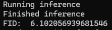
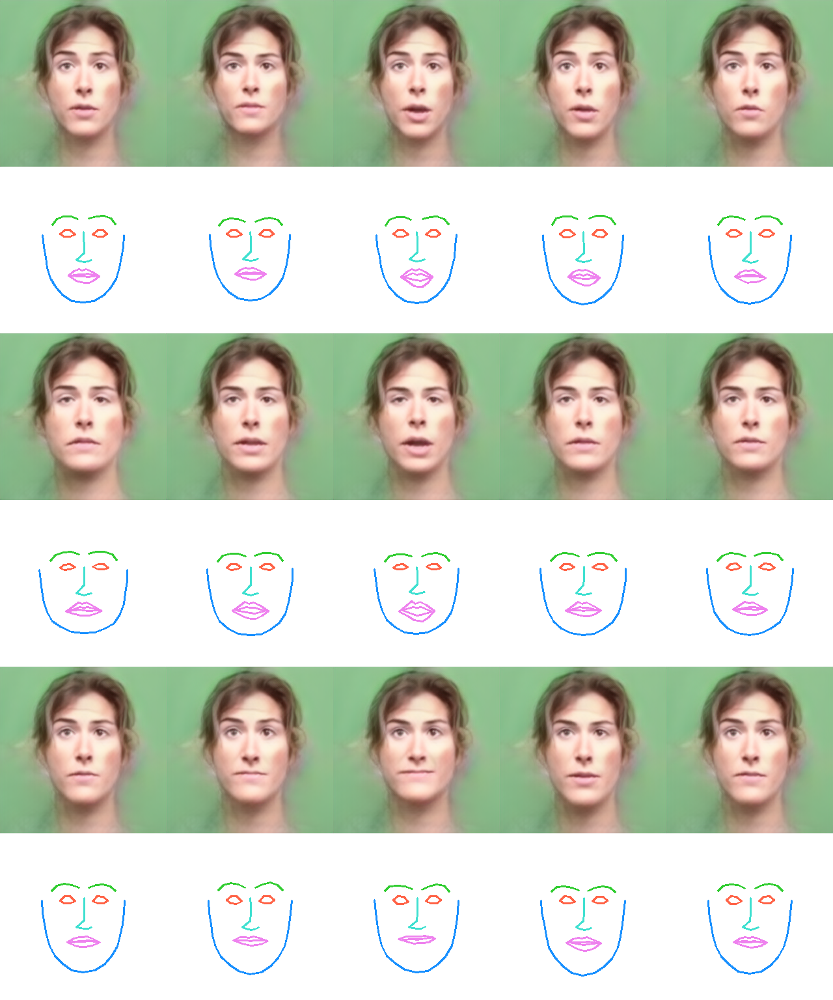
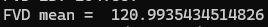

# Reproducing our results

Here we enable the reviewer to:
- Generate a representative figure of our Figure 10 from paper;
- Reproduce the FED and FVD metrics for Speaker 8 (only complete model), as shown in Table 3.

## Installation

Please download the Image2Image translation model and put it under `examples/ckpt/` folder: [Link](https://drive.google.com/file/d/1i2LJXKp-yWKIEEgJ7C6cE3_2NirfY_0a/view?usp=sharing)

### Requirements

- Ubuntu 22.04 LTS
- Docker Engine

### Installing docker

The only requirement for reproducing our results is installing Docker Engine. In order to install it, please:

#### Set up Docker apt repository

```
# Add Docker's official GPG key:
sudo apt-get update
sudo apt-get install ca-certificates curl
sudo install -m 0755 -d /etc/apt/keyrings
sudo curl -fsSL https://download.docker.com/linux/ubuntu/gpg -o /etc/apt/keyrings/docker.asc
sudo chmod a+r /etc/apt/keyrings/docker.asc

# Add the repository to Apt sources:
echo \
  "deb [arch=$(dpkg --print-architecture) signed-by=/etc/apt/keyrings/docker.asc] https://download.docker.com/linux/ubuntu \
  $(. /etc/os-release && echo "$VERSION_CODENAME") stable" | \
  sudo tee /etc/apt/sources.list.d/docker.list > /dev/null
sudo apt-get update
```

#### Install Docker packages

```
sudo apt-get install docker-ce docker-ce-cli containerd.io docker-buildx-plugin docker-compose-plugin
```

#### Verify Installation
```
sudo docker run hello-world
```

In order to run docker without sudo, please follow [Linux Postinstall](https://docs.docker.com/engine/install/linux-postinstall/) (Highly recommended).

## Generating Results

After installing Docker Engine, generating our results should be straightforward. Please execute:
```
./run_all.sh
```

The goal of this script is three-fold:

- Generate one representative figure of our results
- Compute FED metric for Speaker 8
- Compute FVD metric for Speaker 8

First, the script will load our weights, make the inference on test data for Speaker 8, and compute the FED metric. You should see a terminal output like this:



Please notice it matches our result from Table 3, in the <b>Ours</b> column.

Once it's done, it will render the result videos for all test data. The rendering should take around 10 minutes. The representative figure will be available at the `images_volume` folder. You should see this figure:



Please noticet it matches the rendered faces presented in paper Figure 10.

After the rendering, the script will execute the FVD metric. Please notice that FVD is very resource consuming. It should consume ~15GB RAM. If you wish to skip this step, please execute:
```
./run.sh
```

After executing FVD, you should see a terminal output like this:



Please notice it matches our result from Table 3, in the <b>Ours</b> column.